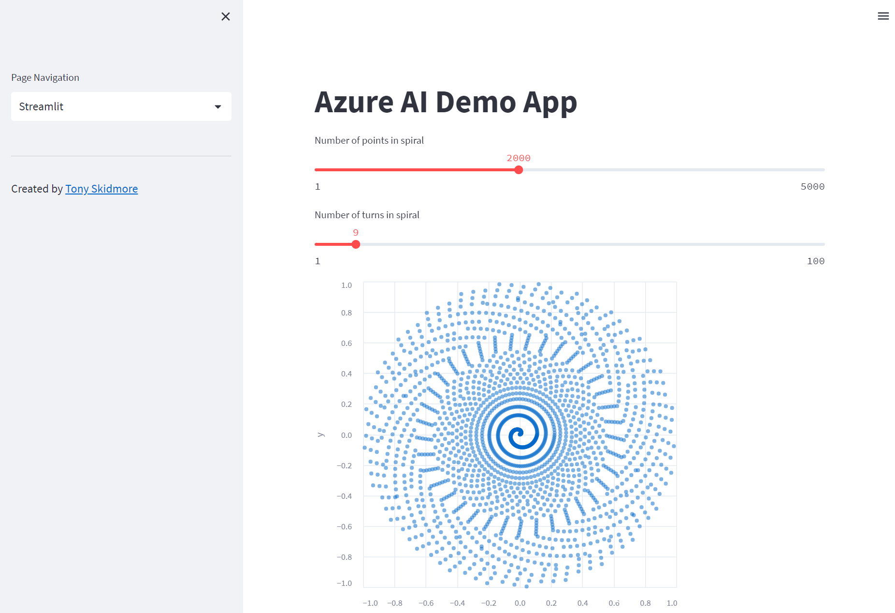

# azure-ai-demo

1. [Overview](#overview)
2. [Run the application locally](#run-the-application-locally)
   * [Pull from GitHub Packages](#pull-from-github-packages)
   * [Build the application locally](#build-the-application-locally)
3. [Deploying to Azure and Azure DevOps](#deploying-to-azure-and-azure-devops)
4. [Azure Cognitive Services](#azure-cognitive-services)
5. [OpenAI ChatGPT](#openai-chatgpt)
6. [Acknowledgements](#acknowledgements)

## Overview

This repo contains code for creating and deploying an example [Streamlit](https://streamlit.io/) application.

"Streamlit is an open-source Python library for building data science web applications. It allows data scientists and machine learning engineers to easily create interactive web applications with simple, easy-to-use Python syntax. With streamlit, data scientists can quickly prototype and deploy deep learning and machine learning models, create dashboards, and build data analysis tools. Streamlit can be used to create web applications for a wide range of tasks, from data exploration to predictive modeling and decision making. The library is built on top of popular Python data science libraries such as Pandas, NumPy, and Matplotlib, and it integrates easily with data sources and web frameworks."

_Note: The above paragraph was written by the ChatGPT page from the demo application._



The demo application was created to show how you can use the following:

* Showcase Streamlit's capabilities
* Putting a web front end in front of a pre-trained machine learning model.
* Using OpenAI REST API as part of an application.
* Using Azure Cognitive Services to provide easy to consume AI to enhance your application.

## Run the application locally

### Pull from GitHub Packages

If you have Docker installed locally then you can pull and run the published container locally:

````bash

docker run \
  --rm \
  -e OPENAI_API_KEY="$OPENAI_API_KEY" \
  -e COG_SERVICE_KEY=<key> \
  -e COG_SERVICE_REGION="uksouth" \
  -e COG_SERVICE_ENDPOINT=https://api.cognitive.microsofttranslator.com \
  -p 8501:8501 \
  --name azure-ai-demo ghcr.io/tonyskidmore/azure-ai-demo:latest

# open http://localhost:8501 in your local browser

````
For the values for `OPENAI_API_KEY` and `COG_SERVICE_KEY` please refer to [OpenAI ChatGPT](#openai-chatgpt) and [Azure Cognitive Services](#azure-cognitive-services) sections respectively.

### Build the application locally

If you have Docker installed locally you can build and test the container application locally by following the steps in `src` directory [README](https://github.com/tonyskidmore/azure-ai-demo/blob/main/src/README.md).


## Deploying to Azure and Azure DevOps

This repo contains Terraform code to deploy the demo Streamlit containerized application to an Azure Web App, including all of the necessary resources to support the deployment e.g. Virtual network, Subnets, Container registry, KeyVault and Cognitive Services.

It will also create an Azure DevOps project, AzureRM service connection, Pipelines (terraform and application), Scale Set Agent pool with an associated self-hosted Azure Virtual Machine Scale Set on the Virtual network.

See the bootstrap [README](https://github.com/tonyskidmore/azure-ai-demo/blob/main/bootstrap/README.md) for more details.


## Azure Cognitive Services

If you don't want to do the full automated deployment above but want to test the Translator demo then you can [Create a Translator resource](https://learn.microsoft.com/en-us/azure/cognitive-services/Translator/create-translator-resource) in the Azure portal and follow the [Build the application locally](#build-the-application-locally) steps.

## OpenAI ChatGPT

To test the ChatGPT functionality you will need to create an [OpenAI](https://beta.openai.com/signup) account.  Once you have done that you will need to [sign in](https://platform.openai.com/account) and [create a key](https://platform.openai.com/account/api-keys).

You will use this to set the `OPENAI_API_KEY` when following either the [Build the application locally](#build-the-application-locally) or [Deploying to Azure and Azure DevOps](#deploying-to-azure-and-azure-devops) sections.

## Acknowledgements

Thanks to [Nicolas Renotte](https://github.com/nicknochnack) for his [I tried to build a Python Machine Learning Streamlit App in 7 Minutes | Coding Challenge](https://www.youtube.com/watch?v=Ebb4gUI2IpQ) YouTube video, which formed the elements of the *Pre-Trained ML Model* section of the app (there is a link to the original source code on that page in the app).
